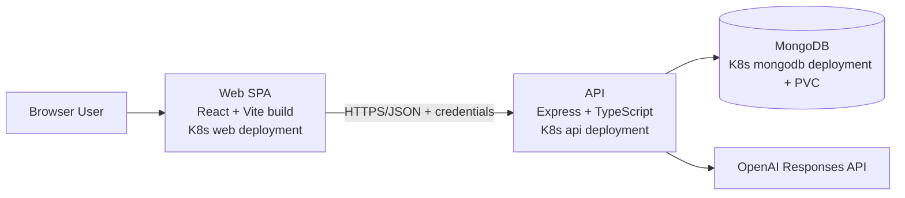

# JobTracker

JobTracker is a full-stack job application tracker built with React, TypeScript, Express, and MongoDB. It helps users manage their application pipeline, review status-based stats, maintain account settings, and compare a resume against a job description.

## Features

- User registration, login, logout, and token refresh
- Protected frontend routes and authenticated API endpoints
- Create, update, delete, search, filter, sort, and paginate job applications
- Dashboard statistics for application progress
- Profile management, password changes, and account deletion
- Resume matching with either pasted resume text or uploaded PDF files
- Centralized frontend API layer and structured backend modules

## Tech Stack

### Frontend

- React 19
- TypeScript
- Vite
- React Router
- Tailwind CSS

### Backend

- Node.js
- Express
- TypeScript
- MongoDB with Mongoose
- Zod validation
- JWT authentication
- Multer for PDF uploads
- OpenAI API integration

## Project Structure

```text
jobtracker/
  apps/
    api/   Express API
    web/   React frontend
  package.json
  README.md
```

## Main Application Areas

### Authentication

The app uses JWT-based authentication with:

- Access tokens sent in the `Authorization` header
- Refresh tokens stored in cookies
- Protected API routes on the backend
- Protected pages on the frontend

### Applications

Users can manage job applications with fields such as:

- Company
- Role title
- Status
- Description
- Location
- Job URL
- Important dates like applied, interview, offer, and rejection dates

### Resume Match

Users can:

- Paste resume text and compare it against a job description
- Upload a PDF resume for extraction and matching
- Review generated match feedback
- Optionally turn a reviewed role into a saved job application

## Getting Started

### Prerequisites

- Node.js 18 or newer
- npm
- MongoDB connection string
- OpenAI API key

### Install Dependencies

From the project root:

```bash
npm install
```

### Environment Setup

Create an API environment file:

```bash
cp apps/api/.env.example apps/api/.env
```

Update `apps/api/.env` with real values:

```env
NODE_ENV=development
PORT=4000
CLIENT_ORIGIN=http://localhost:5173,http://127.0.0.1:5173
MONGODB_URI=your_mongodb_connection_string
MONGODB_DB_NAME=jobtracker
JWT_ACCESS_SECRET=your_access_secret
JWT_REFRESH_SECRET=your_refresh_secret
JWT_ACCESS_EXPIRES_IN=15m
JWT_REFRESH_EXPIRES_IN=7d
OPENAI_API_KEY=your_openai_api_key
```

Create a frontend environment file at `apps/web/.env.local`:

```env
VITE_API_URL=http://localhost:4000/api/v1
```

## Running the Project

Start the API:

```bash
npm run dev:api
```

Start the frontend in a separate terminal:

```bash
npm run dev:web
```

Default local URLs:

- Frontend: `http://localhost:5173`
- API: `http://localhost:4000`

## Kubernetes (Local Cluster)

The repository includes Kubernetes manifests under `k8s/` for:

- `api` deployment and service
- `web` deployment and service
- `mongodb` deployment, service, and PVC

### Build Images

Build API image:

```bash
docker build -t jobtracker-api:latest apps/api
```

Build Web image:

```bash
docker build -t jobtracker-web:latest apps/web
```

If you use Minikube, load images into the cluster runtime:

```bash
minikube image load jobtracker-api:latest
minikube image load jobtracker-web:latest
```

### Create API Secret

`k8s/api-deployment.yaml` expects a secret named `api-secret`.

```bash
kubectl create secret generic api-secret \
  --from-literal=JWT_ACCESS_SECRET=replace_with_access_secret \
  --from-literal=JWT_REFRESH_SECRET=replace_with_refresh_secret \
  --from-literal=OPENAI_API_KEY=replace_with_openai_key \
  --from-literal=MONGODB_DB_NAME=jobtracker
```

### Deploy

```bash
kubectl apply -f k8s/mongodb-pvc.yaml
kubectl apply -f k8s/mongodb-deployment.yaml
kubectl apply -f k8s/mongodb-service.yaml
kubectl apply -f k8s/api-configmap.yaml
kubectl apply -f k8s/api-deployment.yaml
kubectl apply -f k8s/api-service.yaml
kubectl apply -f k8s/web-deployment.yaml
kubectl apply -f k8s/web-service.yaml
```

### Access from Your Machine

Port-forward web and API services:

```bash
kubectl port-forward service/web 8080:80
kubectl port-forward service/api 4000:4000
```

Open:

- Frontend: `http://localhost:8080`
- API: `http://localhost:4000`

For this mode, ensure backend `CLIENT_ORIGIN` includes `http://localhost:8080`.

## Architecture Diagram



## Available Scripts

### Root

- `npm run dev:web` starts the frontend workspace
- `npm run dev:api` starts the backend workspace

### Frontend

Run from `apps/web`:

- `npm run dev`
- `npm run build`
- `npm run lint`
- `npm run preview`

### Backend

Run from `apps/api`:

- `npm run dev`
- `npm run build`
- `npm run start`

## API Overview

### Health

- `GET /api/v1/health`

### Auth

- `POST /api/v1/auth/register`
- `POST /api/v1/auth/login`
- `POST /api/v1/auth/refresh`
- `POST /api/v1/auth/logout`
- `GET /api/v1/auth/me`
- `PATCH /api/v1/auth/me`
- `PATCH /api/v1/auth/password`
- `DELETE /api/v1/auth/me`

### Applications

- `GET /api/v1/applications`
- `POST /api/v1/applications`
- `GET /api/v1/applications/:id`
- `PATCH /api/v1/applications/:id`
- `DELETE /api/v1/applications/:id`
- `GET /api/v1/applications/stats`

### Resume and AI

- `POST /api/v1/ai/resume-match`
- `POST /api/v1/resume/extract-text`
- `POST /api/v1/resume/match`

## Architecture Notes

The backend follows a layered structure:

```text
Route -> Controller -> Service -> Model
```

The frontend uses:

- Route-based page structure
- Protected routes
- Shared UI components
- Centralized API helpers
- Workspace-based app separation

## Current Status

This project already includes:

- Full-stack authentication
- Application tracking workflow
- Resume matching flow
- Frontend and backend TypeScript setup

Areas that can still be improved:

- Automated testing
- CI setup (In Progress)
- API request examples

## License

This project is currently private and does not define a public license.
