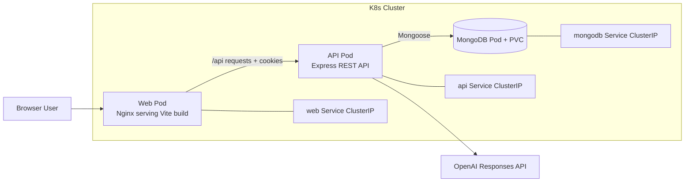
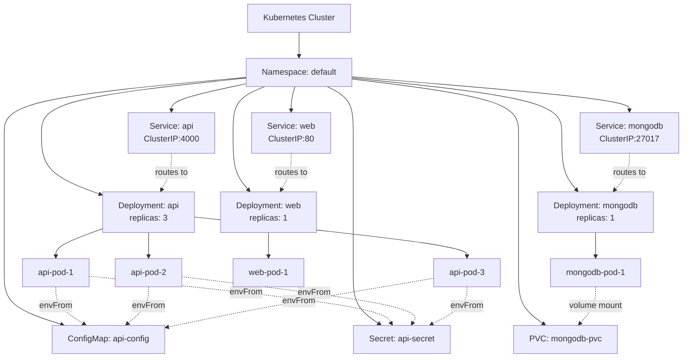

# JobTracker System Design

## 1. Overview

JobTracker is a full-stack web application for managing job applications and evaluating resume fit against a target role. The system is organized as a monorepo with a React frontend and an Express backend. MongoDB is used for persistent storage, and OpenAI is used to generate resume-match analysis.

At a high level, the platform supports:

- User registration and login
- JWT-based authentication with refresh-token cookies
- CRUD operations for job applications
- Search, filtering, sorting, pagination, and dashboard stats
- Profile updates, password changes, and account deletion
- Resume-to-job matching using pasted text or uploaded PDF resumes

## 2. Goals

### Primary Goals

- Provide a secure place for users to track their job applications
- Keep the frontend and backend clearly separated
- Make the API easy to extend with new modules
- Support a resume analysis workflow without overcomplicating the base application

### Non-Goals

- Multi-tenant enterprise administration
- Real-time collaboration
- Complex workflow automation
- Distributed microservices

## 3. Architecture Summary

The system uses a client-server architecture and is deployed in Kubernetes for local development/testing.

### Deployment Architecture (Kubernetes)



For local access, services are reached through `kubectl port-forward`.

### Kubernetes Resource Hierarchy (Pods to Cluster)



## 4. Repository Layout

```text
jobtracker/
  apps/
    api/
      src/
        config/
        db/
        middleware/
        modules/
          auth/
          applications/
          ai/
          resume/
        utils/
    web/
      src/
        auth/
        applications/
        ai/
        components/
        lib/
        pages/
        routes/
  document/
    system-design.md
```

## 5. Frontend Design

### Technology Choices

- React for the single-page application
- TypeScript for safer component and API contracts
- React Router for routing and route protection
- Tailwind CSS for UI styling
- Vite for development and production builds

### Frontend Responsibilities

The frontend is responsible for:

- Rendering pages and forms
- Managing local UI state
- Managing authentication state
- Sending API requests to the backend
- Storing the access token in memory
- Including cookies on requests so refresh-token auth works

### Frontend Structure

Key frontend layers:

- `pages/`: route-level screens such as login, dashboard, applications, settings, and resume match
- `routes/`: router composition and protected route wrapper
- `auth/`: auth provider, context, auth API helpers, and auth state bootstrapping
- `lib/`: shared API client and token storage helpers
- `components/`: reusable UI components

### Routing Model

Public pages:

- `/login`
- `/register`

Protected pages:

- `/dashboard`
- `/applications`
- `/settings`
- `/resume-match`

`RequireAuth` checks auth state and redirects unauthenticated users to the login page.

### Frontend API Layer

The frontend uses a centralized fetch wrapper in `apps/web/src/lib/api.ts`.

Responsibilities of this layer:

- Build URLs from `VITE_API_URL`
- Send `credentials: "include"` on every request
- Add the `Authorization` header when an access token exists
- Parse JSON safely
- Normalize API errors into a reusable `ApiError` class

This pattern reduces duplication across feature modules and creates a single place for future improvements such as automatic refresh-and-retry logic.

## 6. Backend Design

### Technology Choices

- Express for routing and middleware composition
- TypeScript for application code
- Mongoose for schema modeling and database access
- Zod for request validation
- cookie-parser for refresh-token cookies
- CORS middleware for cross-origin frontend access
- Multer for in-memory PDF uploads

### Backend Responsibilities

The backend is responsible for:

- Input validation
- Authentication and authorization
- Business logic for user and application data
- Resume text extraction from uploaded PDFs
- Resume-to-job AI analysis
- Persistence with MongoDB

### Layered Module Pattern

The backend follows this structure:

```text
Route -> Controller -> Service -> Model -> Database
```

#### Routes

Define endpoint paths and attach middleware.

#### Controllers

Handle HTTP concerns such as:

- parsing request data
- calling service functions
- setting cookies
- choosing status codes and response shape

#### Services

Contain business logic such as:

- registering users
- verifying passwords
- filtering applications
- generating stats
- extracting PDF text
- calling OpenAI

#### Models

Define MongoDB schemas, validation, and indexes.

## 7. Runtime and Startup Flow

Startup sequence:

1. Environment variables are loaded and validated with Zod.
2. MongoDB connection is established before the server starts listening.
3. Express middleware is configured.
4. API routes are mounted under `/api/v1`.
5. The server begins listening on `env.PORT`.

This fail-fast startup model is helpful because the application does not accept requests unless required dependencies are configured correctly.

## 7.1 Kubernetes Runtime Flow

1. MongoDB deployment starts and mounts persistent storage through PVC.
2. API deployment starts with environment from ConfigMap + Secret.
3. API readiness and liveness probes check `/api/v1/health`.
4. Web deployment serves static frontend build via Nginx.
5. Developer accesses web and API via local port-forward (for example `8080 -> web:80`, `4000 -> api:4000`).

## 8. Environment Configuration

The backend validates these environment variables:

- `NODE_ENV`
- `PORT`
- `CLIENT_ORIGIN`
- `MONGODB_URI`
- `MONGODB_DB_NAME`
- `JWT_ACCESS_SECRET`
- `JWT_REFRESH_SECRET`
- `JWT_ACCESS_EXPIRES_IN`
- `JWT_REFRESH_EXPIRES_IN`
- `OPENAI_API_KEY`

The frontend expects:

- `VITE_API_URL`

### Design Benefit

Environment validation catches configuration issues early and prevents partially broken runtime behavior.

## 9. Data Model

### User Entity

Stored in MongoDB with the following fields:

- `email`
- `passwordHash`
- `name`
- `createdAt`
- `updatedAt`

Important characteristics:

- `email` is unique
- `passwordHash` is excluded from queries by default
- names are optional

### Application Entity

Stored in MongoDB with fields including:

- `company`
- `roleTitle`
- `description`
- `status`
- `appliedDate`
- `interviewDate`
- `offerDate`
- `rejectionDate`
- `jobUrl`
- `location`
- `userId`
- `createdAt`
- `updatedAt`

Status values:

- `applied`
- `interviewing`
- `offer`
- `rejected`

### Indexing Strategy

Indexes currently include:

- `{ userId: 1, updatedAt: -1 }`
- `{ userId: 1, status: 1, updatedAt: -1 }`

These support:

- per-user listing
- status filtering
- recency sorting

## 10. Authentication and Security Design

### Auth Model

The system uses two tokens:

- Access token: short-lived JWT returned in the JSON response
- Refresh token: longer-lived JWT stored in an HTTP-only cookie

### Why This Design

This design reduces exposure of the long-lived token to browser JavaScript while keeping authenticated API calls simple.

### Login and Registration Flow

1. User submits credentials.
2. Backend validates the request body with Zod.
3. Passwords are hashed with bcrypt during registration.
4. Backend returns:
   - public user info
   - access token in JSON
   - refresh token in an HTTP-only cookie
5. Frontend stores the access token in memory.

### Session Rehydration Flow

When the app loads:

1. `AuthProvider` calls the refresh endpoint.
2. Backend reads the refresh-token cookie.
3. If valid, backend issues a new access token.
4. Frontend stores the new access token.
5. Frontend calls `/auth/me` to fetch the current user.

This allows users to remain logged in without storing the access token in local storage.

### Route Protection

Protected backend routes use `requireAuth`.

The middleware:

- reads the `Authorization` header
- verifies the access token
- attaches `req.user`
- rejects invalid or missing tokens with `401`

Protected frontend routes use `RequireAuth`, which redirects anonymous users to `/login`.

### Cookie Security

Refresh token cookies are configured with:

- `httpOnly: true`
- `path: "/" `
- `sameSite: "lax"` in development
- `sameSite: "none"` in production
- `secure: true` in production

### Authorization Model

All application access is scoped to the authenticated user.

Example query pattern:

```text
{ _id: applicationId, userId: authenticatedUserId }
```

This prevents one user from accessing another user's application records.

## 11. API Design

The API is namespaced under `/api/v1`.

### Health Endpoint

- `GET /api/v1/health`

Used to verify runtime status and database connectivity.

### Auth Endpoints

- `POST /api/v1/auth/register`
- `POST /api/v1/auth/login`
- `POST /api/v1/auth/refresh`
- `POST /api/v1/auth/logout`
- `GET /api/v1/auth/me`
- `PATCH /api/v1/auth/me`
- `PATCH /api/v1/auth/password`
- `DELETE /api/v1/auth/me`

### Applications Endpoints

- `POST /api/v1/applications`
- `GET /api/v1/applications`
- `GET /api/v1/applications/stats`
- `GET /api/v1/applications/:id`
- `PATCH /api/v1/applications/:id`
- `DELETE /api/v1/applications/:id`

### Resume and AI Endpoints

- `POST /api/v1/ai/resume-match`
- `POST /api/v1/resume/extract-text`
- `POST /api/v1/resume/match`

### API Design Notes

- JSON is the primary request/response format
- PDF upload endpoints use `multipart/form-data`
- Validation is applied before business logic
- 204 responses are used where no response body is needed

## 12. Application Management Flow

### Create Application

1. Authenticated user submits form in the frontend
2. Frontend calls the applications API helper
3. Backend validates input
4. Service stores a document with `userId`
5. DTO is returned to the client

### List Applications

The list endpoint supports:

- search via `q`
- status filtering
- sorting
- pagination with `page` and `limit`

The service builds a Mongo query and runs:

- `find(...).sort(...).skip(...).limit(...)`
- `countDocuments(...)`

The response returns:

- `items`
- `page`
- `limit`
- `total`
- `totalPages`

### Update and Delete

Update and delete operations are both ownership-aware and only affect records that belong to the logged-in user.

### Stats

The stats endpoint uses a MongoDB aggregation pipeline to group application counts by status and return a dashboard summary.

## 13. Resume Matching Design

The project supports two matching modes.

### Mode 1: Raw Resume Text

Flow:

1. User pastes resume text and a job description.
2. Frontend sends both to `/api/v1/ai/resume-match`.
3. Backend builds an AI prompt.
4. OpenAI returns a structured JSON-like text response.
5. Backend parses and validates that response with Zod.
6. Frontend renders:
   - match score
   - matched skills
   - missing skills
   - suggestions
   - summary

### Mode 2: Uploaded PDF Resume

Flow:

1. User uploads a PDF file and provides a job description.
2. Multer stores the uploaded file in memory.
3. The resume service extracts plain text from the PDF buffer.
4. The AI service generates the match analysis from extracted text and job description.
5. The frontend displays the result.

### Upload Constraints

- File type must be PDF
- File size limit is 5 MB
- Uploaded file field name is `resume`

### Why Separate Resume and AI Modules

This separation keeps:

- file parsing concerns in the resume module
- model prompting and response validation in the AI module

It also makes it easier to replace or improve either side later.

## 14. Validation and Error Handling

### Validation

Zod is used for request validation on backend inputs.

Benefits:

- consistent input checking
- predictable request shapes
- safer service-layer assumptions

### Error Handling

An application-wide error handler centralizes response formatting for:

- validation errors
- JWT errors
- database issues
- unexpected runtime errors

On the frontend, the shared API client throws `ApiError`, which gives pages a consistent way to display request failures.

## 15. Cross-Origin and Browser Behavior

The backend enables CORS with:

- origin allow-listing from `CLIENT_ORIGIN`
- `credentials: true`

The frontend always sends credentials with requests so the refresh-token cookie can be included.

This is essential because the frontend and backend run on different local origins during development.

In Kubernetes local mode, this also applies when frontend is opened on `http://localhost:8080` and API is forwarded on `http://localhost:4000`.

## 16. Scalability Considerations

The current architecture is appropriate for an early-stage product or portfolio application and can scale moderately with good infrastructure.

### Current Strengths

- clear module boundaries
- stateless access-token verification
- MongoDB indexes for primary application queries
- centralized API client
- isolated AI and resume modules
- route-level rate limiting for auth and compute-heavy endpoints

### Likely Bottlenecks at Higher Scale

- synchronous request-response AI calls can become slow and costly
- in-memory file upload handling is not ideal for large or frequent uploads
- no background queue for resume processing
- no caching layer for expensive repeated operations
- single-region/local-cluster operational assumptions

### Natural Next Improvements

- add structured logging
- add automated tests
- add background jobs for PDF parsing and AI analysis
- add object storage for uploaded resumes if persistent uploads are needed
- add retry and token refresh interception on the frontend API client
- add ingress/TLS when moving beyond local-network usage

## 17. Reliability and Operational Notes

### Good Existing Choices

- environment validation at startup
- database connection before listening for traffic
- graceful shutdown behavior
- explicit CORS policy
- route-level auth protection

### Missing or Not Yet Implemented

- automated unit/integration tests
- CI pipeline
- monitoring and alerting
- cluster ingress and public-domain routing

## 18. Tradeoffs

### Why a Monorepo

Benefits:

- shared context between frontend and backend
- simpler local development
- easier project organization for a single developer

Tradeoff:

- less isolation between deployable units compared with fully separate repos

### Why JWT + Refresh Cookie

Benefits:

- works well for SPAs
- avoids storing the refresh token in JavaScript-accessible storage
- keeps backend auth relatively simple

Tradeoff:

- frontend token lifecycle logic becomes more important
- cookie and CORS settings must be configured carefully

### Why MongoDB

Benefits:

- flexible schema evolution
- easy fit for application-centric documents
- straightforward Mongoose development workflow

Tradeoff:

- relational reporting and advanced constraints are less natural than in SQL systems

## 19. Future Design Opportunities

Potential enhancements that fit the existing architecture:

- interview scheduling and reminders
- tags and notes on applications
- analytics over time
- saved resumes and resume versions
- AI-generated resume rewrite suggestions
- job description parsing into structured fields
- email notifications
- admin or recruiter views

## 20. Conclusion

JobTracker is designed as a pragmatic full-stack application with a clean separation between frontend, backend, persistence, and AI-assisted features. The current architecture is simple enough to understand and extend, but structured enough to support real product features such as authenticated CRUD, statistics, and resume analysis.

Its strongest design qualities are:

- clear modular backend structure
- secure user-scoped data access
- sensible token-based auth flow
- practical frontend organization
- clean separation between application tracking and AI resume workflows

For its current scope, the system design is appropriate, maintainable, and a strong foundation for future growth.
